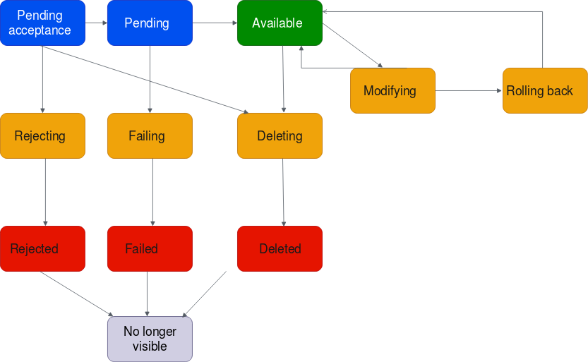

# CloudFormation custom resource - Transit Gateway Peering Attachment Accepter

In this repository you will find a CloudFormation Custom Resource which accepts a 
Transit Gateway Peering Attachment. The Python code for the Lambda can be found in the directory `./transit-gateway-peering-accepter`

A Transit Gateway Attachment can be accepted if the state is `pendingAcceptance` after accepting
the attachment it will go into the `pending` state, if successful the attachment becomes `available` after 2-5 minutes. 

See image below for the whole lifecycle of the attachment:



# Lambda Custom Resource

The Lambda custom resource will wait for the attachment states. The states are handled as follows:

- **pendingAcceptance**: Accept the peering attachment
- **pending, initiating, initiatingRequest**: Wait for pendingAcceptance or a failure
- **available**: Send a `SUCCESS` response to CloudFormation
- **Other states**: Throw an exception and send `FAILED` response to CloudFormation

# CloudFormation Examples

You can find two CloudFormation examples that implement the custom resource.
Two stacks can be found a minimal stack and a full stack.

## Minimal

This is a minimal stack, which only has the Transit Gateway, Peering Attachment and the custom resource peering attachment Accepter.

For deployment of the stack [Sceptre](https://github.com/Sceptre/sceptre) is used.

Deploy the minimal stack
```shell
sceptre launch transit-gateway-peering-minimal
```

Destroy the minimal stack
```shell
sceptre delete transit-gateway-peering-minimal
```

## Full

This is a full stack, which includes everything from the minimal stack and adds a VPC, EC2 and routes to be able to perform a ping test from both the EC2 instances.

For deployment of the stack [Sceptre](https://github.com/Sceptre/sceptre) is used.

Deploy the Full stack
```shell
sceptre launch transit-gateway-peering-full
```

Destroy the Full stack
```shell
sceptre delete transit-gateway-peering-full
```

### Connect to the EC2 instance

To get access to the EC2 instances deployed with the 'full' stack you can use SSM. read more about it [here](https://docs.aws.amazon.com/systems-manager/latest/userguide/session-manager-working-with-sessions-start.html)
